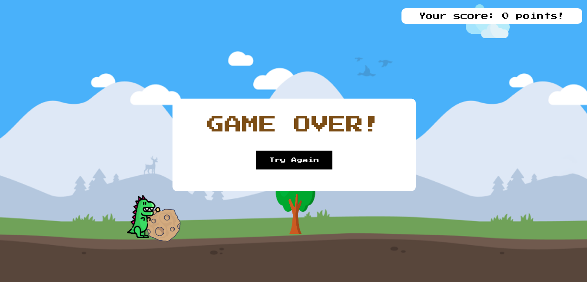

# Dino-Game-TypeScript-OOP

## To install:
npm i
## To run:
npm start

## Rules
Jump above all obstacles.

### Controls
W - Jump  
Long press W - High jump  
A - Left step  
D - Right step  
S - Fast falling after jump  

# Good luck & Have fun :)

-- Type Script with OOP project --
